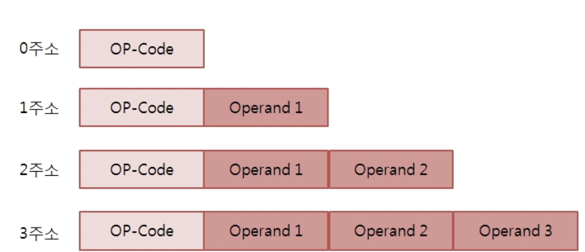

# 시작하기 전에

이번 장에 알아볼 것

- 연산 코드
- 오퍼랜드
- 주소 지정 방식

# 연산 코드와 오퍼랜드

위 이미지에서 보이듯, 명령어는 **연산 코드**와 **오퍼랜드**로 구성된다.  
연산 코드는 **연산자**, 오퍼랜드를 **피연산자**라고 한다.

## 오퍼랜드

오퍼랜드는 '연산에 사용할 데이터' 또는 '연산에 사용할 데이터가 저장된 위치'를 의미한다.  
따라서, 오퍼랜드에는 데이터가 저장된 메모리 주소 or 레지스터 주소가 올 수 있다.  
그래서 오퍼랜드 필드를 **주소 필드**라고 부른다

오퍼랜드는 명령어 안에 하나도 없을 수 있고, 한 개, 두 개 또는 세 개 등 여러 개가 있을 수 있다.
오퍼랜드가 하나도 없는 명령어를 **0-주소 명령어**, 하나인 명령어를 **1-주소 명령어** 두 개를 **2-주소 명령어**, 세 개는 **3-주소 명령어**라고 한다.

## 연산 코드

- 데이터 전송
- 산술/논리 연산
- 제어 호름 변경
- 입출력 제어

등의 연산 코드가 있다.

# 주소 지정 방식

명령어의 공간(비트)이 부족하기 때문에, 여러 주소 지정 방식을 사용한다.

## 즉시 주소 지정 방식

연산에 사용될 데이터를 직접 오퍼랜드 필드에 직접 명시하는 방법입니다.

## 직접 주소 지정 방식

연산에 사용될 데이터가 저장된 메모리 주소를 명시하는 방법입니다.

## 간접 주소 지정 방식

연산에 사용될 데이터가 저장된 데이터의 메모리 주소가 저장된 메모리 주소를 명시하는 방법입니다.  
메모리 주소를 표시하는데에도 한계가 있기 때문이다. 두번 우회하기 때문에 속도가 상대적으로 느리다.

## 레지스터 주소 지정 방식

연산에 사용될 데이터가 저장된 레지스터 주소를 명시하는 방법입니다.

## 레지스터 간접 주소 지정 방식

연산에 사용될 데이터가 저장된 데이터의 레지스터 주소가 저장된 메모리 주소를 명시하는 방법입니다.  
간접 주소 지정 방식과 유사하지만, 메모리를 한번만 참조하기 때문에 속도가 상대적으로 빠르다.

