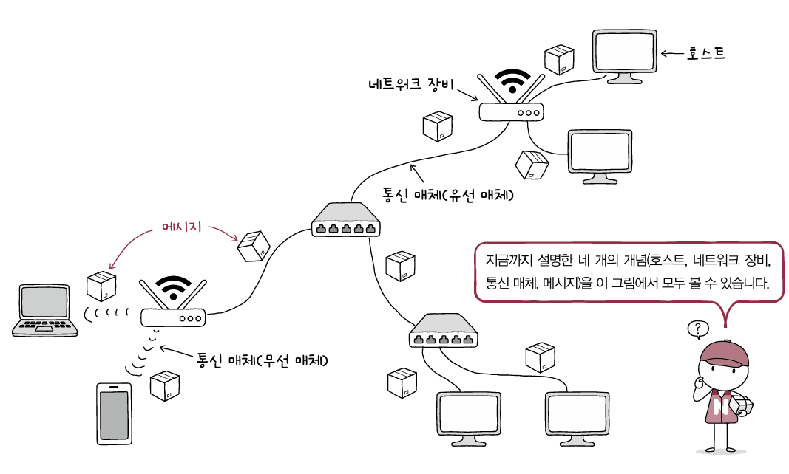

# 네트워크 거시적으로 살펴보기

앞서 네트워크는 **정보를 공유하기 위해 장치들이 연결된 통신망**이라고 했습니다.  
이 통신망은 구조적으로 **그래프 형태**로 연결되어 있습니다.

---

# 네트워크 기본 구조

모든 네트워크는 다음 3가지 요소로 구성됩니다.

- **노드(Node)**
- **간선(Link)**
- **메시지(Message)**

---

## 호스트 (Host)

네트워크 가장자리에 위치한 **종단 시스템**을 호스트라고 합니다.

예  
- 서버  
- 스마트폰  
- PC  

호스트는 네트워크에서 특정 역할을 수행하기도 합니다.

**서버(Server)**  
: 파일, 웹 페이지, 이메일 등의 서비스를 제공하는 호스트

**클라이언트(Client)**  
: 서버에게 서비스를 요청하고 제공받는 호스트

---

## 네트워크 장비

네트워크에는 호스트뿐만 아니라 **정보를 전달하는 중간 장비**도 존재합니다.  
이러한 장비를 **중간 노드**라고 합니다.

대표적인 장비

- 이더넷 허브
- 스위치
- 라우터
- 공유기

이러한 장비들을 통칭하여 **네트워크 장비**라고 합니다.

네트워크 장비는 호스트 간 주고받는 정보가  
**목적지까지 안정적이고 안전하게 전달되도록 하는 역할**을 합니다.

---

## 통신 매체

호스트와 네트워크 장비가 통신하기 위해서는 **통신 매체**가 필요합니다.

통신 매체의 종류

- 유선
- 무선

그래프 구조에서 **노드를 연결하는 간선**이 바로 통신 매체입니다.

---

## 메시지

통신 매체로 연결된 노드들이 **주고받는 데이터**를 메시지라고 합니다.

출처: 혼자 공부하는 네트워크

---

# 범위에 따른 네트워크 분류

네트워크는 **연결 범위**에 따라 여러 종류로 나눌 수 있습니다.

대표적으로 **LAN**과 **WAN**이 있습니다.

---

## LAN

LAN(Local Area Network)

가까운 지역을 연결하는 네트워크입니다.

예

- 가정 네트워크
- 학교 네트워크
- 회사 내부 네트워크

---

## WAN

WAN(Wide Area Network)

멀리 떨어진 **여러 LAN을 연결하는 네트워크**입니다.

인터넷에 접속하기 위해 사용하는 WAN은  
**ISP(Internet Service Provider)**가 구축하고 관리합니다.

---

## ISP (Internet Service Provider)

ISP는 사용자에게 **인터넷 연결 서비스를 제공하는 업체**입니다.

대표적인 ISP

- KT
- SK Broadband
- LG U+

ISP는 사용자에게 **WAN 연결 회선을 임대**하고 다양한 네트워크 서비스를 제공합니다.

우리가 인터넷 요금을 내는 이유도 **이 회선을 사용하기 때문**입니다.

---

## 인터넷 연결 구조

ISP는 사용자의 집이나 회사까지 인터넷 회선을 연결합니다.

사용자 PC
│
공유기
│
건물 통신실
│
ISP 지역망
│
ISP 백본망
│
다른 ISP / 글로벌 인터넷
│
웹 서버 (예: Google)

ISP는 다음과 같은 역할을 수행합니다.

- 사용자와 인터넷 연결
- IP 주소 할당
- 라우팅 관리
- 트래픽 전달

인터넷은 사실 **ISP들이 서로 연결된 거대한 네트워크**입니다.

---

## IX (Internet Exchange)

ISP들은 **IX(Internet Exchange)** 라는 곳에서 서로 연결됩니다.

이를 통해 서로 다른 ISP 간에도 데이터 교환이 가능합니다.

---

## WAN ≠ 인터넷

인터넷이 WAN의 전부는 아닙니다.

특정 조직은 **공개되지 않은 전용 WAN**을 구축할 수도 있습니다.

예

- 기업 전용망
- 금융망
- 군 통신망

---

## 기타 네트워크 종류

추가적으로 다음과 같은 네트워크도 존재합니다.

**CAN (Campus Area Network)**  
대학교 캠퍼스 단위 네트워크

**MAN (Metropolitan Area Network)**  
도시 단위 네트워크

---

# 메시지 교환 방식에 따른 네트워크 분류

네트워크는 메시지를 전달하는 방식에 따라 다음 두 가지로 나뉩니다.

- 회선 교환 방식
- 패킷 교환 방식

---

# 회선 교환 방식 (Circuit Switching)

회선 교환 방식은 **두 호스트가 통신하기 전에 전송 경로(회선)를 미리 확보**하는 방식입니다.

즉

- 두 호스트가 연결됨
- 전송 경로 확보

라는 의미입니다.

이 방식은 **전화망**에서 대표적으로 사용됩니다.

---

## 특징

- 통신 전에 전용 회선 확보
- 통신이 끝날 때까지 회선 독점
- 전송 데이터량이 비교적 일정

이 과정에서 **회선 스위치(Circuit Switch)** 라는 장비가  
호스트 간 회선을 설정하는 역할을 합니다.

---

## 단점

데이터를 보내지 않아도 **회선은 계속 점유됩니다.**

예
전화 통화 10분
실제 대화 4분
침묵 6분

회선 점유 시간 = 10분

따라서 **네트워크 자원이 낭비될 수 있습니다.**

---

# 패킷 교환 방식 (Packet Switching)

패킷 교환 방식은 **메시지를 작은 단위인 패킷으로 나누어 전송하는 방식**입니다.

현재 **대부분의 인터넷 통신**이 이 방식을 사용합니다.

---

## 동작 방식

메시지를 전송하면

1. 데이터를 여러 개의 패킷으로 분할
2. 네트워크를 통해 전달
3. 수신지에서 다시 재조립

---

## 특징

- 네트워크 이용 효율이 높음
- 여러 사용자가 네트워크 공유 가능
- 패킷마다 다른 경로로 전달 가능

패킷은 사전에 정해진 경로 없이 여러 노드를 거쳐 전달됩니다.

이 과정에서 **패킷 스위치**가  
패킷을 목적지까지 전달합니다.

---

## 패킷 스위치 장비

대표적인 장비

- 라우터
- 스위치

---

## 패킷 구조

패킷은 다음 요소로 구성됩니다.

- **헤더(Header)**  
  패킷의 송수신지 정보

- **페이로드(Payload)**  
  실제 데이터

- **트레일러(Trailer)**  
  오류 검사 정보

---

# 주소와 송수신지 유형에 따른 전송 방식

패킷의 헤더에는 **송신지와 수신지 주소**가 포함됩니다.

대표적인 주소

- IP 주소
- MAC 주소

이 주소를 기반으로 여러 전송 방식이 존재합니다.

---

## 유니캐스트 (Unicast)

**하나의 송신자가 하나의 수신자에게 전송**

---

## 브로드캐스트 (Broadcast)

**네트워크 내 모든 호스트에게 전송**

브로드캐스트가 전송되는 범위를  
**브로드캐스트 도메인**이라고 합니다.