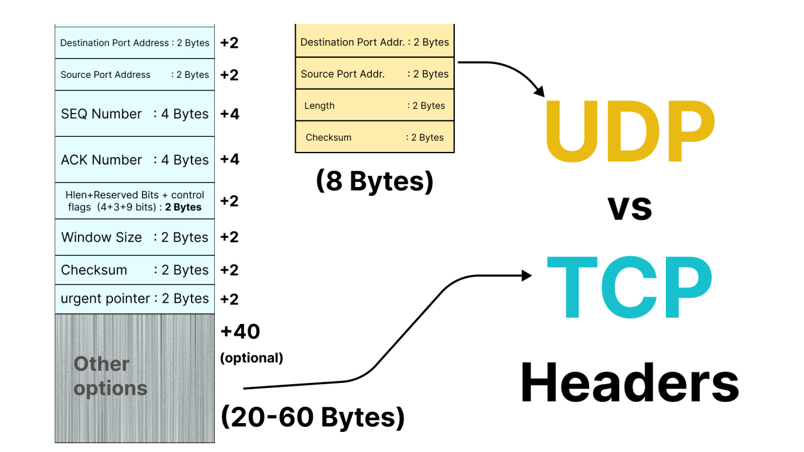
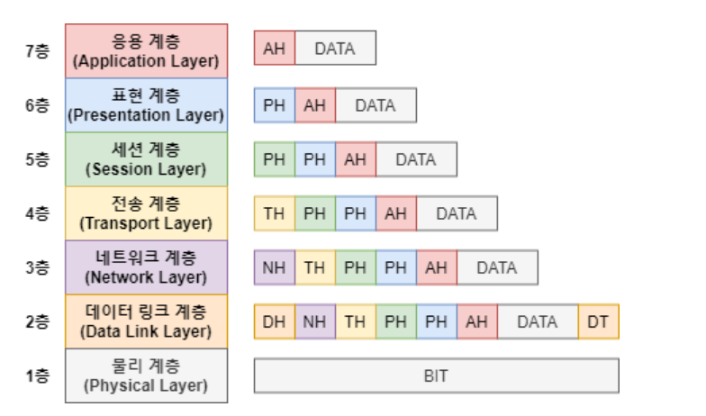
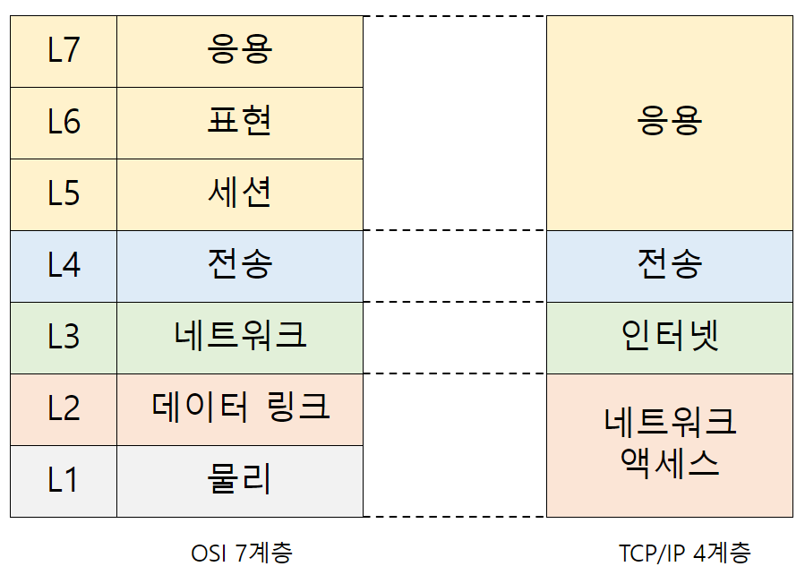

# 네트워크 미시적으로 살펴보기

## 시작하기 전에

- 프로토콜: 통신 과정에서 정보를 올바르게 주고받기 위해 합의된 규칙이나 방법
- 네트워크 참조 모델: 통신이 일어나는 구조를 계층화한 것
- 캡슐화(역캡슐화): 통신 과정에서 이루어지는 것(?)

## 프로토콜

현재 인터넷의 대부분은 호스트 간 패킷을 교환하는 방식인 패킷 교환 방식을 사용한다.

택배로 비유를 하자면,
프로토콜은 택배가 배달되는 과정, 배달된 후에 사용되는 언어(송장, 책(페이로드)의 내용)

**노드 간의 정보를 주고받기 위한 규칙**

서로 다른 통신 장치들이 동일한 프로토콜을 사용해야 한다
=> 네트워크 장비도?

IP, ARP, TCP/UDP, HTTP/HTTPS 모두 프로토콜이며 저마다 목적과 특징을 가진다.

**TCP/UDP 헤더의 차이**

## 네트워크 참조 모델

택배를 주고받는 것도 정형화된 순서가 있다.
네트워크도 마찬가지인데, 이 과정을 계층으로 표현할 수 있다.
계층으로 표현한다는 점에서, 네트워크 계층 모델이라고 한다.

이와 같이 통신 과정을 계층으로 나눈 이유는 크게 두 가지이다.

### 첫째, 네트워크 구성과 설계가 용이하다.
계층의 목적에 맞게 프로토콜과 네트워크 장비를 계층별로 구성할 수 있다.
하지만, 모든 상황에 부합하는 건 아니다. 특히 네트워크 장비는 상위 하위 계층을 포괄하는 경우가 많다.

### 둘째, 네트워크 문제 진단과 해결이 용이하다.
문제의 원인을 계층별로 분석해서 파악하기 쉽다.

1계층: 케이블 유무선 접속 상태 확인
2계층: 정보가 수신지까지 전달되었나
3계층: ...

### OSI 모델
국제 표준화 기구

**1. 물리 계층**
0과 1의 비트 신호를 주고받는 계층이며, 가장 근원적인 통신이 이루어진다.
같은 비트 데이터라도, 통신 매체에 따라 빛, 전기, 전파 등의 신호로 운반될 수 있다.
주로 통신 매체, 네트워크 장비에 대한 이론

**2. 데이터 링크 계층**
네트워크 내 주변 장치 간의 정보를 올바르게 주고 받기 위한 계층이다.
다음 장에서 학습할 이더넷을 비롯한 LAN 기술이 데이터 링크 계층에 녹아있다.
물리 계층을 통해 주고받는 정보에 오류가 없는 지 확인하고, MAC 주소라는 주소 체계를 통해 네트워크 내 송수신지를 특정할 수 있다.

**3. 네트워크 계층**
메시지를 다른 네트워크까지 전달하는 계층이다.
네트워크 계층에서는 다른 네트워크 간의 통신이 이루어진다.
인터넷을 가능하게 하는 계층이라고 할 수 있다.

IP 주소 체계를 이용해 수신지 호스트와 네트워크를 식별하고, 원하는 수신지에 도달하기 위한 최적의 경로를 설정한다.

**4. 전송 계층**
신뢰성 있고, 안정성 있는 전송(수신)을 해야 할 때 필요한 계층이다.
패킷이 정상 발신 되었는지, 유실 정보는 없는지, 순서가 바뀐 패킷은 없는지
이때 전송 계층에서는 패킷의 흐름을 제어하거나 전송 오류를 점검, 포트를 통해 응용 프로그램 식별 등

**5. 세션 계층**
말 그대로 '세션'을 관리하기 위한 계층
통신을 주고 받는 호스트의 응용 프로그램 간 연결 상태를 의미한다.
세션 계층에서는 이러한 연결 상태를 생성, 유지하고, 종료되었을 때 끊어준다.

**6. 표현 계층**
사람의 문자를 컴퓨터가 이해할 수 있는 문자로 변환한다.
코드 변환, 압축, 암호화 같은 작업이 진행

**7. 응용 계층**
OSI 최상단으로 사용자 및 사용자가 사용하는 응용 프로그램에 대한 계층이다.
응용 프로그램에 다양한 네트워크 서비스를 제공한다.
웹 브라우저에 웹 페이지를 제공하거나 송수신된 이메일을 제공 등 실질적인 네트워크 서비스
응용 프로그램에 다양한 서비스가 있는 만큼 프로토콜이 많다.

### TCP/IP 모델

**1. 네트워크 엑세스 계층**
네트워크 엑세스, 링크, 네트워크 인터페이스 계층이라고도 부른다.
OSI 7계층의 물리, 데이터 링크 계층에 대응된다.
유선 LAN과 관련한 물리 계층과 데이터 링크 계층은 2장

**2. 인터넷 계층**
네트워크 계층과 유사하다. 3장에서 학습한다.

**3. 전송 계층**
전송 계층과 유사하다. 4장에서 학습한다.

**4. 응용 계층**
세션, 표현, 응용 계층을 합친 것과 유사하다. 5장에서 학습할 예쩡

## 캡슐화와 역캡슐화
송신 과정에서 캡슐화, 수신 과정에서 역캡슐화가 이루어진다.

### 캡술화
상위 계층의 헤더+페이로드는 하위 계층의 페이로드가 된다.

### 역캡슐화
캡슐화의 반대 과정으로, 디캡슐레이션이라고도 하는데, 페이로드를 꺼내는 과정을 말한다.

## PDU(Protocol Data Unit)
각 계층에서 송수신되는 메시지의 단위이다.
